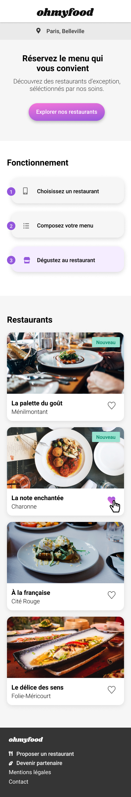

# Ohmyfood

### Projet 3 | Parcours "Développeur web" OpenClassrooms - Dynamisez une page web avec des animations CSS

## Mission

Intégrer les maquettes mobile et desktop pour le site Ohmyfood et le développer en "mobile first". Ce site répertorie les menus des restaurants gastronomiques et les clients pourront composer le menu de leur repas.

## Spécificités fonctionnelles

#### Header

* Présent sur toutes les pages
* Sur la page d'accueil : logo du site
* Sur les pages de menu : bouton retour vers la page d'accueil

#### Footer

* Identique sur toutes les pages
* Au clic sur "Contact", renvoi vers une adresse email

#### Boutons

* Au survol, la couleur de fond des boutons principaux devra légèrement s'éclaircir
* L'ombre portée doit être plus visible
* Au clic, un bouton *J'aime* en forme de coeur doit se remplir progressivement
* Pour cette première version, l'effet peut apparaître au survol au lieu du clic sur desktop

#### Page d'Accueil (1x)

* Affichage de la localisation des restaurants
* Courte présentation de l'entreprise
* Section contenant les 4 menus sous forme de cartes
* Au clic sur la carte, l'utilisateur est redirigé vers la page du menu
* "Loading spinner" :
    * Doit apparaître de 1 à 3 secondes
    * Doit couvrir l'intégralité de l'écran
    * Doit utiliser des animations CSS 
    * Son design doit être cohérent avec la charte graphique du site

#### Pages de menu (4x)

* 4 pages contenant chacune le menu d'un restaurant
* À l'arrivée sur la page, les plats doivent apparaître :
    * Progressivement, avec un léger décalage dans le temps
    * Soit un par un, soit par groupe "Entrée", "Plat", "Dessert"
* En cliquant sur un plat, une coche à droite du plat doit apparaître
* La coche doit coulisser de la droite vers la gauche
* Pour cette première version, l'effet peut apparaître au survol au lieu du clic sur desktop
* Si l'intitulé du plat est trop long, il doit être rogné avec des points de suspension

## Spécificités techniques

* Les polices :
    * Logos et titres : *Shrikhand*
    * Textes : *Roboto*
* Les couleurs :
    * Primaire (#9356DC)
    * Secondaire (#FF79DA)
    * Tertiaire (#99E2D0)
* Les maquettes mobile à disposition :
    * Page d'Accueil
    * Page Restaurant "La palette du goût"
    * Page Restaurant "Le délice des sens"
    * Page Restaurant "La note enchantée"
    * Page Restaurant "À la française"
* Les maquettes desktop  à disposition :
    * Page d'Accueil
    * Menu "La palette du goût"

## Compatibilité

* Le site doit être développé en utilisant l'approche mobile-first
* Le site doit s'adapter sur tablette et desktop, mais leur mise en page est libre
* L'ensemble du site doit être responsive sur mobile, tablette et desktop
* Les pages doivent passer aux validateurs W3C en HTML et CSs
* Le site doit être compatible avec les dernières versions desktop de Chrome et Firefox

## Technologies

* Le développement se fait en CSS uniquement, sans JavaScript
* Aucun framework n'est autorisé
* L'utilisation de Sass est un plus
* Aucun code CSS ne doit être appliqué via un attribut style dans une balise HTML
* Le code doit être versionné sur GitHub et accessible sur GitHub Pages : https://carolepignat.github.io/Ohmyfood/